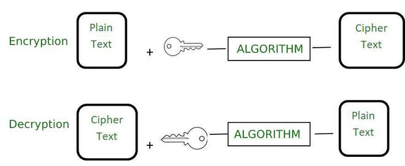
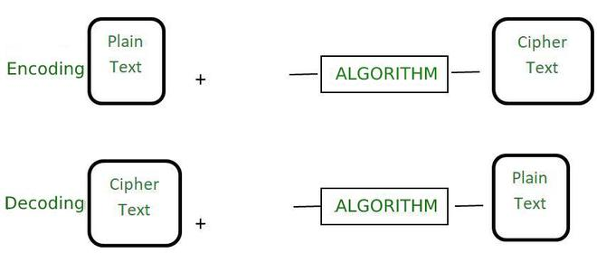

# Encryption vs Encoding

## Encryption & Decryption


Encryption is a process used to convert simple readable data known as plain text to unreadable data known as ciphertext which can only be converted to plain text if the user knows the encryption key. It is used basically to keep our data safe. The main purpose of the encryption is to convert our data in such a form that it is garbage for the person who does not know the encryption key. It is used to prevent unauthorized access. The reverse of encryption is decryption and it is used to get back the plain text from the ciphertext. For decryption, we must know the encryption key and the encryption algorithm. 

## Encoding & Decoding


Encoding is the process to transform data in such a format that it can be easily used by different types of systems. The algorithm used to encode the data is publicly available and it can be easily decoded in the readable form if the person knows the algorithm. It does not require any key to decode the information. The main purpose is data usability instead of confidentiality. The main aim of encoding is to transform the data so that it can be properly used by a different type of system. It is not used to protect the data as it is easy to reverse in comparison to encryption. 

This process is used to ensure the integrity and usability of data. The real-life examples are like binary data being sent over email or viewing special characters on a web page. The main goal is data usability.

## Comparison
||Encryption|Encoding|
|--- |--- |--- |
|Definition|It is the process to encode data securely such that only the authorized user who knows the key or password is able to retrieve the original data for everyone else it is just garbage.|It is the process of transforming data into such a format that it can be used by a different type of system using publicly available algorithms.|
|Purpose|The purpose of encryption is to transform data to keep it secret from others.|The main purpose is the protection of the integrity of data.|
|Used for|It is used to maintain data confidentiality.|It is used to maintain data usability.|
|Reverse Process|The original data can be retrieved using decryption.|The original data can be retrieved using decoding. The algorithm used to encode the data is publicly available.|
|Key requirement|The encryption key is required to decrypt the data and get the original data.|The encryption key is not required to decrypt the data and get the original data.|
|Secure|The encrypted data is more secure.|The encoded data is less secure. It can easily be decoded.|
|Example of Algorithm|AES, RSA, and Blowfish.|ASCII, UNICODE, URL encoding, Base64.|
|Real-life example|Securely sending a password over the internet.|viewing special characters on the web page.|

Credit: https://www.geeksforgeeks.org/difference-between-encryption-and-encoding/

## Hashing
Hashing is the process of transforming any given key or a string of characters into another value. This is usually represented by a shorter, fixed-length value or key that represents and makes it easier to find or employ the original string.

Credit: https://www.techtarget.com/searchdatamanagement/definition/hashing

## Challenge
The first part of the challenge for tonight will involve working in your pair to implement and test an encryption & decryption algorithm of your choice. You should be able to accept plaintext and output the cipher text, and also accept cipher text and output the plaintext. But before deciding on an algorithm, find another pair in the room who is planning to implement the same algorithm. Do not work with that pair yet though - stay in your own pair to implement and test your algorithm.

The second part of the challenge is to exchange secret messages with the other pair you talked to. Once both pairs have completed their implementation and testing, you should be able to give them your cipher text, and they should be able to decrypt it and you can tell them if it is correct or not; and you should be able to accept their cipher text, decrypt it, and confirm with them if it is correct or not. In this part, be sure to note what complications you run into, as you are working across the pairs. And be a hacker too - listen to other pairs to see if you can "intercept" their cipher text and decrypt it. Maybe even talk to another pair to see if you can crack their cipher text without knowing what algorithm they implemented. We will talk about this experience at the end.

### Suggestions
Here are some suggestions for algorithms to implement, but feel free to research and choose your own. Try to stay away from using your language's crypto libraries - while those would certainly be more secure than these suggestions, you will miss out on some of the learnings you will get by implementing your own.

#### Caesar Cipher or ROT-13
The [Caesar Cipher](https://en.wikipedia.org/wiki/Caesar_cipher) (or [ROT-13](https://en.wikipedia.org/wiki/ROT13), which is just a specialization of the Caesar Cipher) is a substitution cipher where each character is "shifted" (replaced by another character that is further down in the alphabet), wrapping around to the beginning if needed.

In pseudocode:
```javascript
function caesarEncrypt(plaintext, shift):
    ciphertext := ""
    for each character in plaintext:
        if character is an uppercase letter:
            encryptedChar := (character + shift - 'A') % 26 + 'A'
        else if character is a lowercase letter:
            encryptedChar := (character + shift - 'a') % 26 + 'a'
        else:
            encryptedChar := character
        append encryptedChar to ciphertext
    return ciphertext

function caesarDecrypt(ciphertext, shift):
    return caesarEncrypt(ciphertext, 26 - shift)
```

#### XOR Cypher
The [XOR Cypher](https://en.wikipedia.org/wiki/XOR_cipher) takes each plaintext character and performs an XOR operation on it with a specified key value. Because of the way an XOR operation works, decryption is accomplished by simply running the encryption process again with the same key.

In pseudocode:
```javascript
function xorEncrypt(plaintext, key):
    ciphertext := ""
    for each character in plaintext:
        encryptedChar := character XOR key
        append encryptedChar to ciphertext
    return ciphertext

function xorDecrypt(ciphertext, key):
    return xorEncrypt(ciphertext, key)  // XOR decryption is the same as encryption
```

This cipher is most easily implemented by repeating the key for each character in the plaintext.

### One-Time Pad
[One-Time Pad](https://en.wikipedia.org/wiki/One-time_pad), also known as the Vernam Cipher, is very similar to the XOR cipher, but with some important "key" differences. The difference is in the requirements of the "key" For One-Time Pad, the key must be exactly the same length as the text being encrypted, and it should be a truly random key with no repetition. The algorithm is very similar though, and in pseudocode, looks identical.

In pseudocode:
```javascript
function vernamEncrypt(plaintext, key):
    ciphertext := ""
    for each character in plaintext:
        encryptedChar := character XOR key
        append encryptedChar to ciphertext
    return ciphertext

function vernamDecrypt(ciphertext, key):
    return vernamEncrypt(ciphertext, key)  // Vernam decryption is the same as encryption

```

### Starter Projects
See solutions in different languages in the "Templates" directory. Once you decide which language you'd like to use,
simply open that directory in your favorite IDE, and you should be able to run the included unit tests "out of the box".

The recommended IDEs are as follows, but feel free to use whatever IDE you are comfortable with.

-   [C#](Templates/C%23) - [Microsoft Visual Studio](https://visualstudio.microsoft.com/vs/community/)
-   [Java](Templates/Java) - [IntelliJ Idea](https://www.jetbrains.com/idea/download) (Community Edition is fine)
-   [JavaScript](Templates/JavaScript) - [Microsoft Visual Studio Code](https://code.visualstudio.com/)
-   [Kotlin](Templates/Kotlin) - [IntelliJ Idea](https://www.jetbrains.com/idea/download) (Community Edition is fine)
-   [Python](Templates/Python) - [Pycharm](https://www.jetbrains.com/pycharm/download/?section=windows) (Community Edition is fine)
-   [TypeScript](Templates/TypeScript) - [Microsoft Visual Studio Code](https://code.visualstudio.com/)
